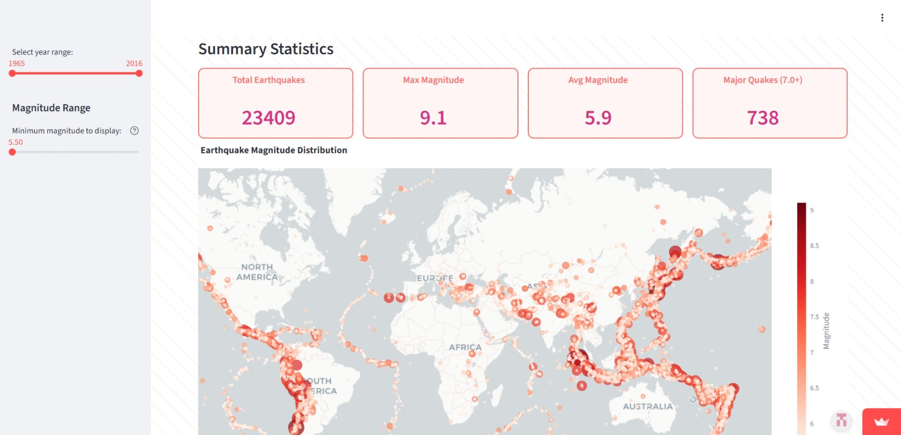
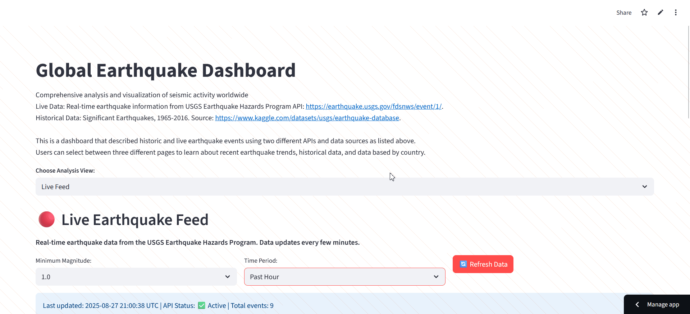

# Earthquake Monitor App

A real-time earthquake monitoring application built with Streamlit that provides up-to-date seismic activity data from the USGS Earthquake Hazards Program.

## Features

- **Real-time earthquake data** from USGS API
- **Historical earthquake** data from National Earthquake Information Center kaggle dataset
- **Interactive world map** with earthquake markers
- **Customizable filtering** by magnitude and timeframe
- **Detailed earthquake information** including location, depth, and impact data



## Pages & Functionality

### Main Dashboard
The home page provides an overview of recent seismic activity with key statistics and quick access to filtering options.

**Features:**
- Recent earthquake summary
- Quick magnitude and timeframe filters
- Key statistics display



### Interactive Map
Visualize earthquake locations on an interactive world map with customizable markers and popup information.

**Features:**
- Color-coded earthquake markers by magnitude
- Clickable popups with detailed earthquake information
- Zoom and pan functionality
- Real-time data updates


### Global Historical Earthquake map
Browse historical earthquake data from 1965 to 2016 dataset from National Earthquake Information Center NEIC static dataset.

**Features:**
- Year range selector
- Magnitude selector
- Interactive map show magnitude based on circle size and shade. 


### Analytics & Statistics
View trends and patterns in seismic activity through charts and statistical analysis.

**Features:**
- Magnitude distribution charts
- Timeline visualizations
- Depth analysis
- Geographic distribution statistics

*[Add analytics screenshot/GIF here]*

## Installation & Setup

```bash
# Clone the repository
git clone [your-repo-url]

# Install dependencies
pip install -r requirements.txt

# Run the application
streamlit run app.py
```

## Requirements

- Python 3.8+
- Streamlit
- Pandas
- Plotly
- Requests
- Folium

## Data Source

This application uses real-time data from the [USGS Earthquake Hazards Program](https://earthquake.usgs.gov/earthquakes/feed/v1.0/geojson.php) API.

## Usage

1. **Select timeframe**: Choose from hour, day, week, or month
2. **Set magnitude filter**: Filter earthquakes by minimum magnitude (1.0, 2.5, 4.5, or significant)
3. **Explore the data**: Use the map, table, and analytics views to analyze earthquake activity
4. **Get details**: Click on individual earthquakes for detailed USGS information

*[Add usage workflow GIF here]*

## Contributing

Contributions are welcome! Please feel free to submit a Pull Request.

## License

This project is licensed under the MIT License - see the LICENSE file for details.

## Acknowledgments

- Data provided by the U.S. Geological Survey Earthquake Hazards Program
- Built with Streamlit and other open-source libraries
