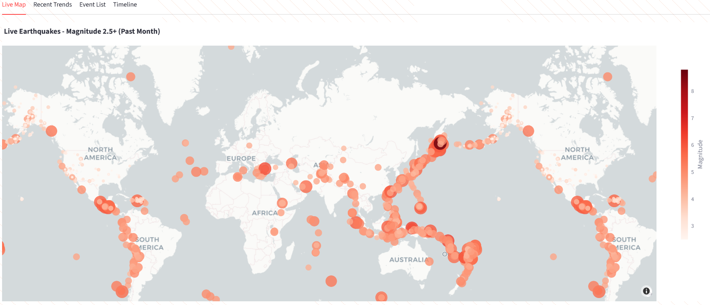
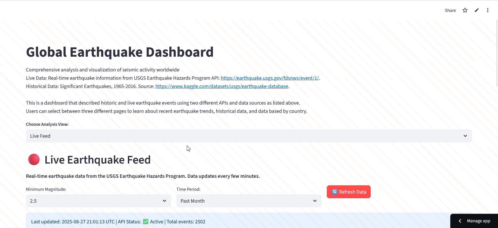
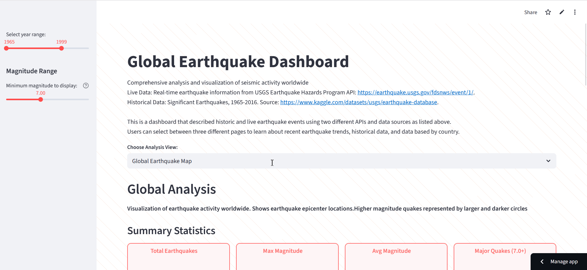

# Earthquake Monitor App

A real-time earthquake monitoring application built with Streamlit that provides up-to-date seismic activity data from the USGS Earthquake Hazards Program live API data.
Two pages dedicated to historical earthquake data sourced from National Earthquake Information Center NEIC dataset. 

Allows users to find information about recent and historical earthquakes, their locations, magnitude and several statistics about earthquake frequency and national occurence. 



## Features

- **Real-time earthquake data** from USGS API
- **Historical earthquake** data from National Earthquake Information Center kaggle dataset
- **Interactive world map** with earthquake markers
- **Customizable filtering** by magnitude and timeframe
- **Detailed earthquake information** including location, depth, and impact data

## Pages & Functionality

### Live USGS Earthquake Feed
The home page provides an overview of recent seismic activity with key statistics and quick access to filtering options. It contains a map that displays recorded earthquakes from up to a month ago and their coordinate epicenters.
The map displays higher magnitude earthquakes with larger and darker circles. Above the map are several statistics total number of events in the selected time frame and magnitude, latest magnitude of an earthquake,
maximum earthquake magnitude, number of 5+ magnitude quakes, as well as average depth. In addition to the live map, there is a recent trends section containing bar graph depicting a count of earthquakes by magnitude, an event list that catalogues all recent quakes, and a timeline graph that charts all recent earthquakes by magnitude and date of occurence.

**Key Features:**
- Recent earthquake summary
- Quick magnitude and timeframe filters
- Key statistics display


### Global Historical Earthquake map
Shows historical earthquake data from 1965 to 2016 dataset from National Earthquake Information Center NEIC static dataset. Contains interactive map with year range and magntiude sliders to view all earthquakes in the dataset based on coordinate locatiojn and magnitude.
Also contains a bar chart representing the number of quakes by magnitude and a graph of all quake occurences by magnitude and year. 

**Key Features:**
- Year range selector
- Magnitude selector
- Interactive map show magnitude based on circle size and shade. 



### Historical Earthquakes by Country Map
A global map of earthquake frequency by country. Quake epicenter coordinates were roughly attributed to countries, and this map shows an estimate of the number of earthquakes each country has been subject to. This is not 100% accurate and many earthquakes do not occur within the bounds of a country, especially those that occur deep in the ocean. This page also includes a country ranking in terms of number of earthquakes as well as a frequency vs magnitude graph.

**Key Features:**
- Magnitude distribution charts
- Timeline visualizations
- Depth analysis
- Geographic distribution statistics



## Installation & Setup

```bash
# Clone the repository
git clone [your-repo-url]

# Install dependencies
pip install -r requirements.txt

# Run the application
streamlit run app.py
```

## Requirements

- Python 3.8+
- Streamlit
- Pandas
- Plotly
- Requests
- Folium

## Data Source

This application uses real-time data from the [USGS Earthquake Hazards Program](https://earthquake.usgs.gov/earthquakes/feed/v1.0/geojson.php) API.
And National Earthquake Information Center NEIC 1965-2016 dataset: https://www.kaggle.com/datasets/usgs/earthquake-database
